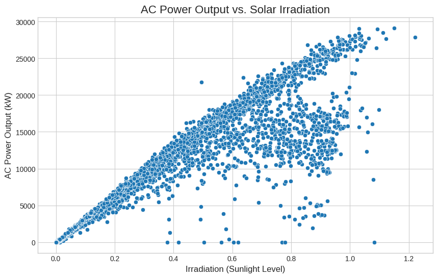
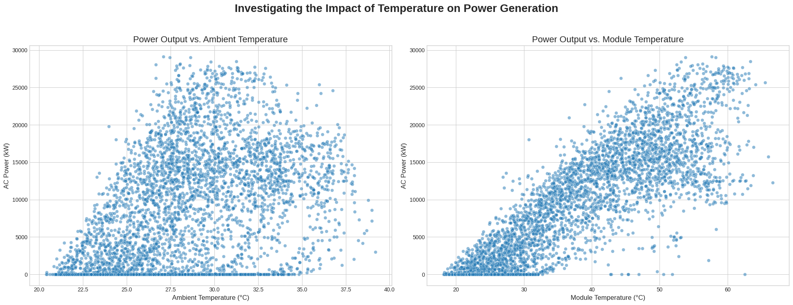
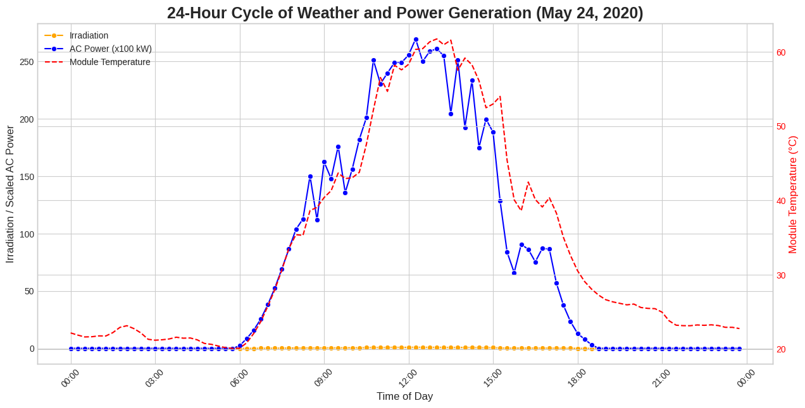
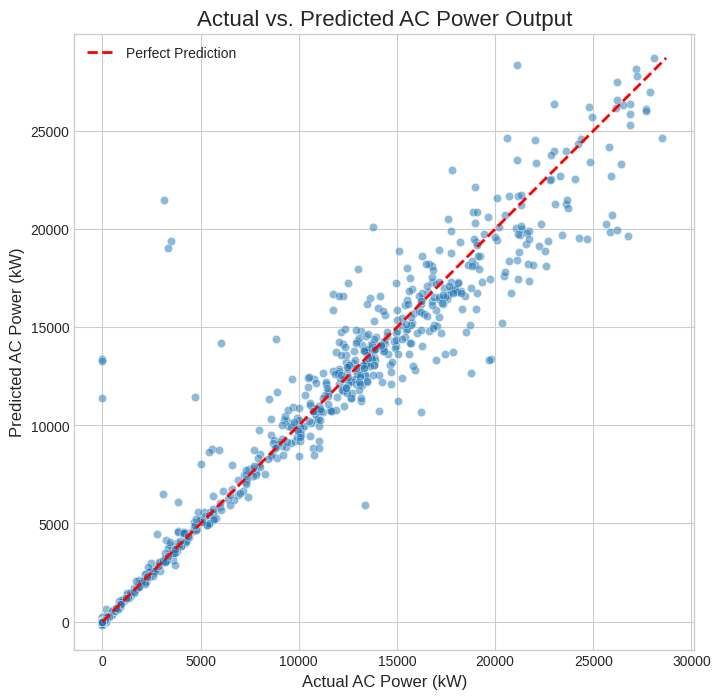
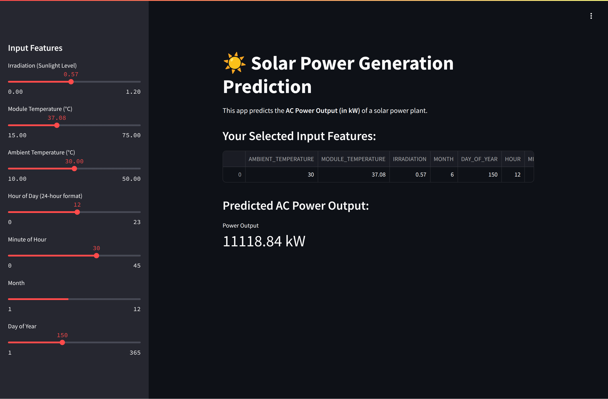

# Final Report: A Machine Learning Approach to Solar Power Prediction

## Introduction

Accurate forecasting of renewable energy generation is critical for modern power grid management and energy trading. For solar power, output is highly dependent on variable meteorological conditions. The ability to predict power generation based on weather forecasts is essential for ensuring grid stability and optimizing energy dispatch.

This project undertakes an end-to-end machine learning workflow to address this challenge. The primary goal was to build and evaluate a predictive model that could accurately forecast the AC power output of a solar power plant using time-series weather data. The project involved extensive data curation from multiple sources, feature engineering, and a comparative analysis between a powerful tree-based ensemble model (XGBoost) and a deep learning model (Neural Network) to determine the most effective approach for this regression task. Finally, the best-performing model was deployed into a live, interactive web application.

## Data Analysis & Computation

### Datasets, Wrangling, & Cleaning

The analysis was performed on a public dataset from Kaggle, containing time-series data from two solar power plants in India over a 34-day period.

* **Data Sources:** The data was provided in four separate CSV files: a power generation file and a weather sensor file for each of the two plants.
* **Data Curation Process:**
    * **Data Loading & Datetime Conversion:** All four files were loaded into pandas DataFrames. A critical first step was to handle two different string formats for the `DATE_TIME` column, converting them into a standardized datetime object to enable merging.
    * **Data Aggregation:** It was identified that the generation data was recorded at the individual solar inverter level (many readings per timestamp), while weather data was at the plant level (one reading per timestamp). To resolve this, the generation data was aggregated by `DATE_TIME`, summing the `AC_POWER` and `DC_POWER` to get the total plant output for each 15-minute interval.
    * **Merging & Concatenation:** The aggregated generation data was merged with the corresponding weather data for each plant. Finally, the data from both plants was concatenated into a single master DataFrame.
    * **Final Dataset:** This process resulted in a single, clean, and analysis-ready dataset, which was saved as `solar_curated_data.pkl`. An initial check confirmed there were no missing values.

### Feature Engineering

To help the model understand daily and seasonal cycles, new time-based features were engineered from the `DATE_TIME` column: `MONTH`, `DAY_OF_YEAR`, `HOUR`, and `MINUTE`. These, along with the weather data, formed the final feature set.

### Exploratory Data Analysis (EDA)

The EDA focused on understanding the relationships between the weather features and the target variable, `AC_POWER`.

* **Insight 1: Irradiation is the Primary Driver:** A scatter plot of `IRRADIATION` vs. `AC_POWER` revealed a very strong, positive, and mostly linear relationship, confirming that the amount of sunlight is the most important factor in power generation.

**

* **Insight 2: Temperature's Negative Impact:** Scatter plots of `MODULE_TEMPERATURE` vs. `AC_POWER` clearly visualized the "temperature derating" effect, where solar panel efficiency and maximum power output decrease at very high temperatures. This identified module temperature as a crucial secondary predictor.

**

* **Insight 3: The Daily Cycle:** A line plot of key variables over a single 24-hour period illustrated the clear daily "bell curve" of irradiation and power, and the lagging curve of module temperature, providing a holistic view of the plant's daily operation.

**

### Modeling and Evaluation

The data was prepared for modeling using a standard `scikit-learn` pipeline (train-test split and `StandardScaler`). Two models were trained and compared.

* **Baseline Model (XGBoost):** An XGBoost Regressor was trained as a powerful baseline. It performed exceptionally well, achieving an **R-squared ($R^2$) of 0.9578**. The scatter plot of its predictions versus actual values showed a very tight correlation, indicating high accuracy.

**

* **Comparative Model (Neural Network):** A feed-forward neural network was built with `TensorFlow/Keras` to see if a deep learning approach could capture more complex patterns. While it also performed well (R² of ~0.94), it did not surpass the performance of the XGBoost baseline.

## Model Deployment: Interactive Web Application

To demonstrate the real-world utility of the predictive model, the best-performing model (XGBoost) was deployed as an interactive web application using the **Streamlit** library.

* **Functionality:** The application features a simple user interface with sliders corresponding to the model's input features (Irradiation, Module Temperature, Hour of Day, etc.). When a user adjusts the sliders, the app feeds the inputs to the trained model in real-time and displays the predicted AC power output in kilowatts.
* **Technology:** The app is built from a single Python script (`app.py`) and uses `joblib` to load the pre-trained XGBoost model and data scaler.

**

## Conclusion

This project successfully developed a high-performance machine learning model capable of predicting solar power output with approximately 96% accuracy. The analysis concludes that for this structured, time-series regression task, an **XGBoost Regressor provided superior performance compared to a standard neural network architecture.** Furthermore, the project demonstrated the full end-to-end data science lifecycle, from raw data curation and exploratory analysis to comparative modeling and final deployment in a live, interactive application.

## References & Acknowledgements

* The dataset for this project, "Solar Power Generation Data," was sourced from **Kaggle**.
