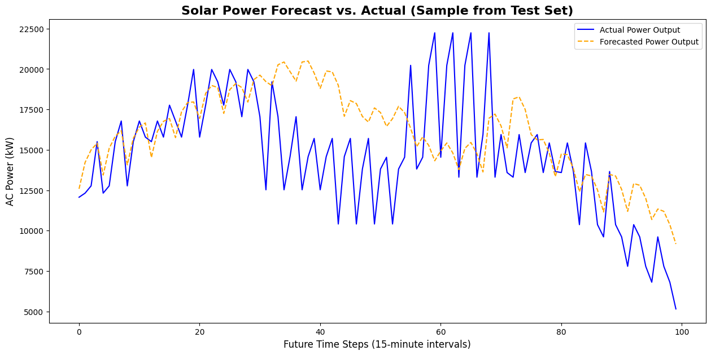

# Advanced Solar Power Forecasting with Machine Learning

## Project Overview

This project develops and evaluates a series of machine learning models to predict and forecast the power generation of solar power plants based on time-series weather data. This project showcases an end-to-end data science workflow, demonstrating a progression from foundational regression models to advanced deep learning techniques for time-series forecasting.

The workflow begins with data curation and exploratory data analysis (EDA). A baseline regression model using **XGBoost** is established and compared against a standard neural network. The project then advances to a more complex problem: forecasting power output for the next hour using a **Long Short-Term Memory (LSTM) recurrent neural network**, a specialized architecture for sequential data.

---

## Key Findings

1.  **Irradiation as the Primary Driver:** EDA confirmed a strong, positive, and mostly linear relationship between Solar Irradiation and AC Power Output, identifying it as the most critical predictive feature.
2.  **Temperature's Impact:** The analysis also revealed a clear "temperature derating" effect, where panel efficiency decreases at very high module temperatures.
3.  **Superior Regression Model:** For the task of predicting instantaneous power output, a **well-tuned XGBoost Regressor (R² ≈ 0.96)** significantly outperformed a standard neural network, proving to be the most effective model for that specific problem.
4.  **Successful Time-Series Forecasting:** The more advanced **LSTM model** successfully learned the temporal patterns in the data. It was able to forecast the next hour's power generation by tracking the daily "bell curve" shape of solar output, demonstrating a powerful capability beyond simple regression.

## Dataset

* **Solar Power Generation Data:** The dataset, sourced from Kaggle, contains 34 days of 15-minute time-series data from two separate solar power plants, including both power generation and weather sensor data.

## Methodology & Tools

1.  **Data Curation:** Raw data from four separate CSV files was loaded, cleaned, and aggregated. Inverter-level power data was summed to the plant level for each timestamp to match the granularity of the weather data.
2.  **Feature Engineering:** Time-based features—`MONTH`, `DAY_OF_YEAR`, `HOUR`, and `MINUTE`—were extracted from the `DATE_TIME` column to help models learn daily and seasonal cycles.
3.  **Part A: Regression Modeling:**
    * The data was prepared for standard regression (train-test split, scaling).
    * An **XGBoost Regressor** was trained as a baseline and compared against a **Feed-Forward Neural Network**. Both were evaluated on their ability to predict instantaneous power output.
4.  **Part B: Time-Series Forecasting (Advanced):**
    * The data was re-prepared using a "windowing" technique, where sequences of the last 6 hours of data were used to predict the next hour's output.
    * An **LSTM Recurrent Neural Network** was built using TensorFlow/Keras to learn from these sequences and forecast future values.

## Regression Model Performance

For the task of predicting instantaneous power output, the XGBoost model was the clear winner.

| Metric | XGBoost (Baseline) | Neural Network |
| :--- | :--- | :--- |
| **R-squared ($R^2$)** | **0.9578** | 0.9403 |
| **MAE (kW)** | **587.20** | 846.80 |

## Time-Series Forecast Visualization

The LSTM model was able to successfully forecast the rise and fall of power generation over the course of a day. The plot below shows a sample of the model's forecast (orange) closely tracking the actual power output (blue).

**

---

## Repository Contents

* **`01_Solar_Data_Curation.ipynb`**: Details the full process of loading, cleaning, and merging the source data.
* **`02_Solar_EDA_and_Modeling.ipynb`**: Contains the exploratory data analysis and the comparative analysis of the regression models (XGBoost vs. standard NN).
* **`03_Solar_Advanced_Forecasting_LSTM.ipynb`**: Contains the time-series data preparation and the development and evaluation of the LSTM forecasting model.
* **`solar_curated_data.pkl`**: The clean, analysis-ready dataset.
* **`app.py`**: A Streamlit script that deploys the best regression model (XGBoost) into an interactive web app.

## Tools & Libraries Used

* Python 3
* Pandas & NumPy
* Scikit-learn
* XGBoost
* TensorFlow (Keras)
* Streamlit
* Matplotlib & Seaborn
